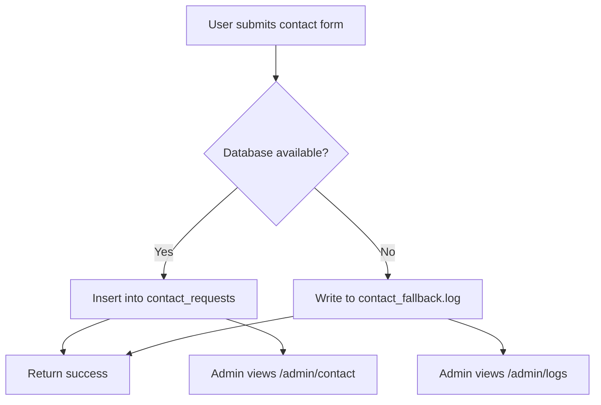

# 📚 YourBooks Admin & Public App

A **Next.js 13+ (App Router)** application for managing public contact requests and secure admin functionality, with a **database-first + file fallback logging system** to prevent data loss.

---

# 📑 Table of Contents

1. [Project Overview](#project-overview)
2. [Project Structure](#project-structure)
3. [Environment Variables](#environment-variables)
4. [Features](#features)

   * Contact Form Submission
   * Admin Dashboard
   * Logging System
   * Middleware & Authentication
   * UI / Styling
5. [Database Schema](#database-schema)
6. [Running the Project (Development)](#running-the-project-development)
7. [Running in Production (PM2)](#running-in-production-pm2)
8. [Contact Submission Flow](#contact-submission-flow)
9. [Screenshots](#screenshots)
10. [Important Notes](#important-notes)

---

# 📌 Project Overview

This project provides:

* A **public contact form**
* A secure **Admin dashboard**
* A **database-first logging strategy**
* Automatic **fallback file logging if DB fails**
* JWT-based authentication
* Middleware route protection

The system ensures **zero data loss** for contact submissions.

---

# 📁 Project Structure

```
📁 yourbooks
 ├─ app
 │   ├─ (legal)
 │   │   ├─ cancellation-refund-policy/page.tsx
 │   │   ├─ privacy-policy/page.tsx
 │   │   └─ layout.tsx
 │   ├─ admin
 │   │   ├─ contact/page.tsx
 │   │   ├─ logs/page.tsx
 │   │   └─ layout.tsx
 │   ├─ api
 │   │   ├─ auth
 │   │   ├─ contact/route.ts
 │   │   ├─ logs/route.ts
 │   │   └─ system/log/route.ts
 │   ├─ components
 │   ├─ hooks
 │   ├─ lib
 │   │   ├─ audit.ts
 │   │   ├─ init-db.ts
 │   │   ├─ mysql.ts
 │   │   └─ utils.ts
 │   ├─ login/page.tsx
 │   ├─ layout.tsx
 │   └─ middleware.ts
 ├─ public
 ├─ ecosystem.config.js
 ├─ .env.local
 └─ package.json
```

---

# 🔐 Environment Variables

Create `.env.local` at project root:

```env
# Database
DB_HOST=localhost
DB_USER=root
DB_PASSWORD=your_password_here
DB_NAME=YourbooksQuery
DB_PORT=3306

# JWT
JWT_SECRET=your_super_secret_key


```

---

# 🚀 Features

---

## 1️⃣ Contact Form Submission

* Public users submit contact form.
* API route: `/api/contact`
* **Primary storage:** `contact_requests` table
* **Fallback storage:** `contact_fallback.log` (JSON lines)

If DB fails:

* Submission is written to `contact_fallback.log`
* API still returns `{ success: true }`
* User experience is uninterrupted

### Example Fallback Log Entry

```json
{
  "name": "Jane Smith",
  "email": "janesmith@example.com",
  "mobile": "9876543210",
  "message": "Interested in books",
  "created_at": "2026-02-22T17:01:27.676Z",
  "error": "Access denied for user 'root'@'localhost'"
}
```

---

## 2️⃣ Admin Dashboard

### `/admin/contact`

* Displays DB contact entries
* Responsive table
* Empty state supported

### `/admin/logs`

* Reads from `contact_fallback.log`
* Shows fallback entries with error messages
* Empty state if no logs

### Authentication

* JWT stored in `admin_token` cookie
* Middleware protects `/admin/*`
* Unauthorized users redirected to `/login`

---

## 3️⃣ Logging System

### Database First Strategy

```
Try DB insert
   ↓
If fail → Write to contact_fallback.log
```

### Audit Logging

Admin actions (login/logout) can be stored in:

```
audit_logs table
```

via `lib/audit.ts`

---

## 4️⃣ Middleware & Route Protection

* Validates JWT
* Protects admin routes
* Public routes excluded:

```ts
const PUBLIC_ROUTES = ["/login", "/reset-password"];
```

---

## 5️⃣ UI / Styling

* TailwindCSS
* Reusable UI components
* Responsive admin dashboard
* Toast notifications
* Consistent layout structure

---

# 🗄 Database Schema

```sql
CREATE TABLE IF NOT EXISTS contact_requests (
  id INT AUTO_INCREMENT PRIMARY KEY,
  name VARCHAR(255) NOT NULL,
  email VARCHAR(255) NOT NULL,
  mobile VARCHAR(20) NOT NULL,
  message TEXT,
  created_at TIMESTAMP DEFAULT CURRENT_TIMESTAMP
);

CREATE TABLE IF NOT EXISTS users (
  id INT AUTO_INCREMENT PRIMARY KEY,
  username VARCHAR(100) NOT NULL UNIQUE,
  password VARCHAR(255) NOT NULL,
  role ENUM('admin','viewer') DEFAULT 'admin',
  created_at TIMESTAMP DEFAULT CURRENT_TIMESTAMP
);

CREATE TABLE IF NOT EXISTS audit_logs (
  id INT AUTO_INCREMENT PRIMARY KEY,
  user_id INT,
  action VARCHAR(255),
  created_at TIMESTAMP DEFAULT CURRENT_TIMESTAMP
);
```

---

# 🧪 Running the Project (Development)

```bash
npm install
npm run dev
```

Open:

```
http://localhost:3000
```

---

# 🏭 Running in Production (PM2)

This project supports PM2 process management.

Example `ecosystem.config.js`:

```js
module.exports = {
  apps: [
    {
      name: "yourbooks-next",
      script: "npm",
      args: "start -- -p 3010",
      instances: 1,
      autorestart: true,
      watch: false,
      max_memory_restart: "500M",
      env: {
        NODE_ENV: "production",
      },
    },
  ],
};
```

### Production Steps

```bash
npm install
npm run build
pm2 start ecosystem.config.js
pm2 save
```

App runs on:

```
http://localhost:3010
```

To expose publicly:

* Use reverse proxy (Nginx)
* Or use Cloudflare Tunnel

---

# 🔄 Contact Submission Flow



---

# 📸 Screenshots

### Server Logs — With Fallback Entries


### Server Logs — Empty State


---

# ⚠ Important Notes

1. If DB fails → data is never lost.
2. Fallback logs are stored as JSON lines.
3. JWT_SECRET must be set.
4. Do not commit `.env.local`.
5. Always run `npm run build` before production start.
6. Use HTTPS in production.

---

# ✅ Summary

This system provides:

* Secure admin authentication
* Reliable contact request handling
* Automatic database fallback logging
* Production-ready PM2 setup
* Clean UI and structured architecture
* Zero data loss guarantee for submissions
