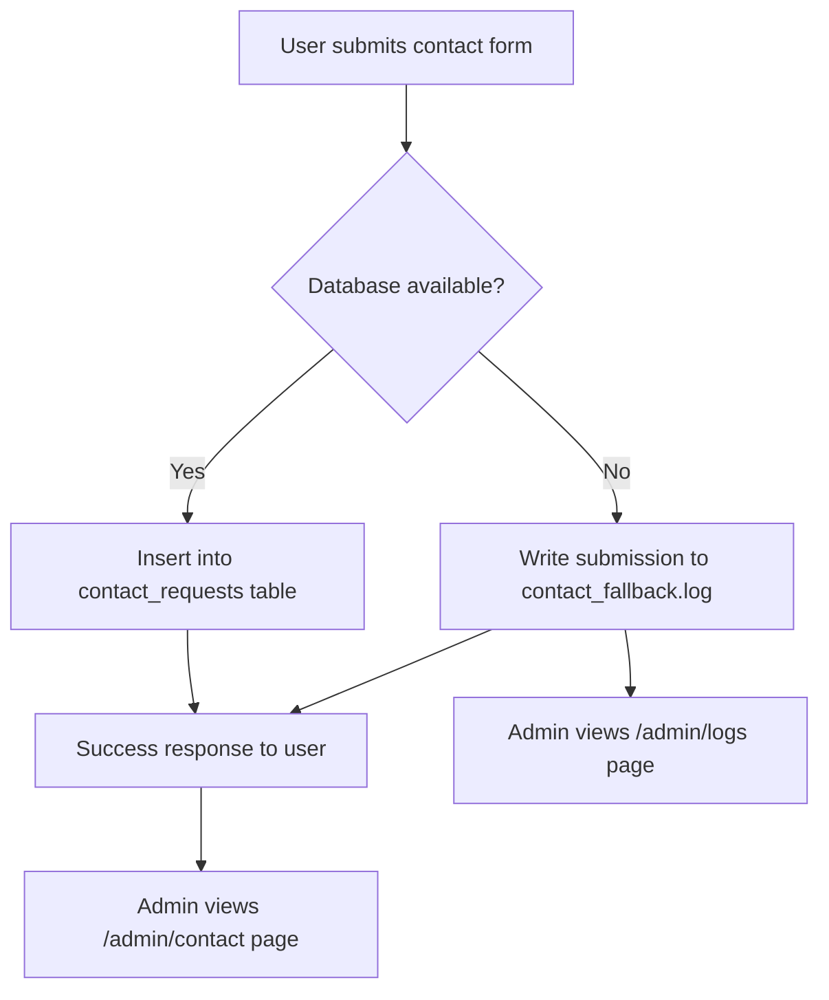
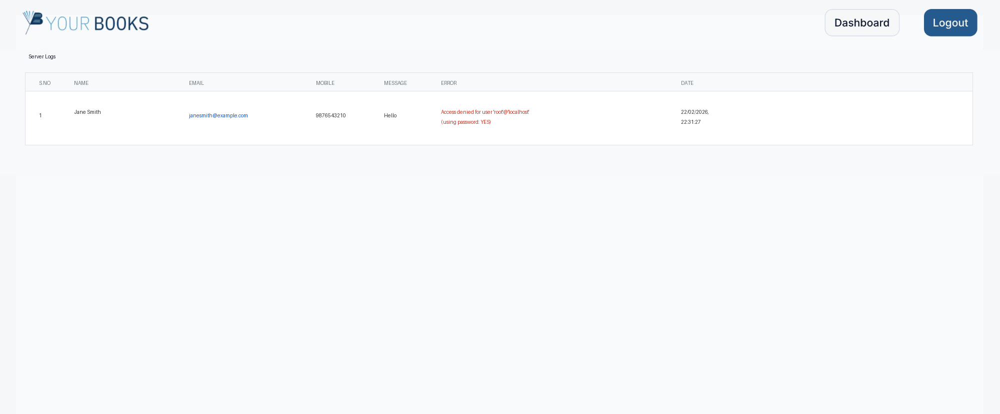
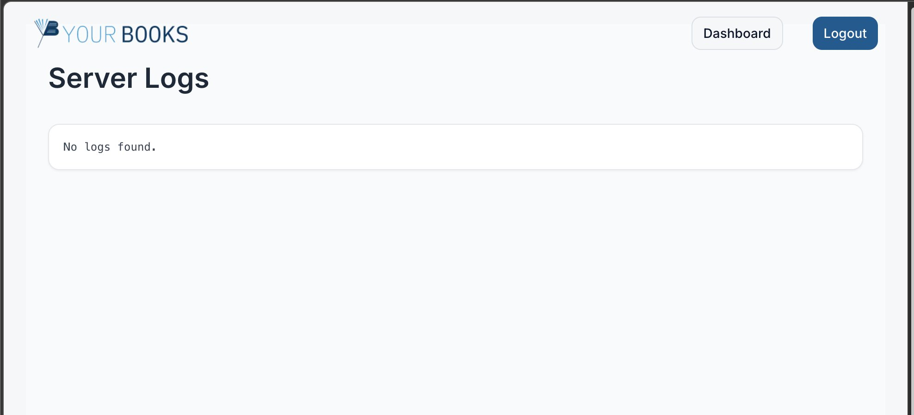

# YourBooks Admin & Public App

This is a **Next.js 13+ project** for managing book-related contact requests and admin functionality, with a focus on **logging fallback data** if the database fails.

---

## **Project Structure**

```
📁yourbooks
 ├─ app
 │   ├─ (legal)
 │   │   ├─ cancellation-refund-policy/page.tsx
 │   │   ├─ privacy-policy/page.tsx
 │   │   └─ layout.tsx
 │   ├─ admin
 │   │   ├─ contact/page.tsx         # Admin dashboard for contact requests
 │   │   ├─ logs/page.tsx            # Admin view for server logs
 │   │   └─ layout.tsx
 │   ├─ api
 │   │   ├─ auth
 │   │   │   ├─ login/route.ts
 │   │   │   ├─ logout/route.ts
 │   │   │   ├─ reset-password/route.ts
 │   │   │   └─ change-password/route.ts
 │   │   ├─ contact/route.ts         # Handles form submissions & DB logging
 │   │   ├─ logs/route.ts            # Serves server-side log file to admin
 │   │   └─ system/log/route.ts
 │   ├─ assets
 │   ├─ components
 │   │   ├─ Navbar.tsx
 │   │   ├─ ContactSection.tsx
 │   │   └─ ui (Tailwind components)
 │   ├─ hooks
 │   ├─ lib
 │   │   ├─ audit.ts
 │   │   ├─ init-db.ts
 │   │   ├─ mysql.ts
 │   │   └─ utils.ts
 │   ├─ login/page.tsx
 │   ├─ layout.tsx
 │   └─ middleware.ts
 ├─ public
 ├─ .env.local
 └─ package.json
```

---

## **Environment Variables**

Create a `.env.local` file at the project root:

```env
# Database
DB_HOST=localhost
DB_USER=root
DB_PASSWORD=your_password_here
DB_NAME=YourbooksQuery
DB_PORT=3306

# JWT secret
JWT_SECRET=your_super_secret_key

# Public base URL (for fetch calls)
NEXT_PUBLIC_BASE_URL=http://localhost:3000
```

---

## **Features**

### **1. Contact Form Submission**

- Users can submit a contact form.
- **Database first**: Tries to insert into `contact_requests` table.
- **Fallback**: If DB connection fails, saves request to `contact_fallback.log` in project root.
- API always returns `success: true` to the client, so user experience is uninterrupted.

**Example log entry**:

```json
{
	"name": "Jane Smith",
	"email": "janesmith@example.com",
	"mobile": "9876543210",
	"message": "Interested in books",
	"created_at": "2026-02-22T17:01:27.676Z",
	"error": "Access denied for user 'root'@'localhost' (using password: YES)"
}
```

---

### **2. Admin Dashboard**

- **Route:** `/admin/contact`
  - Displays **contact requests** from the DB.
  - Empty state shown if no requests.
  - Shows **Name, Email, Mobile, Date** in a responsive table.

- **Route:** `/admin/logs`
  - Displays **fallback logs** when DB insert fails.
  - Reads from `contact_fallback.log`.
  - Shows each field including error message and timestamp.
  - Empty state if no logs.

- **Admin Authentication**:
  - JWT stored in `admin_token` cookie.
  - Middleware (`middleware.ts`) protects `/admin/*` routes.
  - Redirects unauthorized users to `/login`.

---

### **3. Logging System**

- **Database fails → Fallback file logging**
  - Contact submissions are saved to `contact_fallback.log` using JSON lines (`\n` separated).
  - Admins can view logs in `/admin/logs`.
  - Example log file path: `yourbooks/contact_fallback.log`

- **Audit Logs**
  - Admin actions like login/logout can optionally be logged in `audit_logs` table (via `lib/audit.ts`).

---

### **4. Middleware**

- **JWT validation** for admin routes.
- Checks for `admin_token` cookie.
- Redirects unauthorized access to `/login`.
- Public routes (login, reset-password) are ignored by middleware.

```ts
const PUBLIC_ROUTES = ["/login", "/reset-password"];
```

---

### **5. Admin Features**

- Login with username/password.
- Logout button in Navbar.
- Admin-only links: Dashboard, Logs.
- Desktop & mobile support with responsive Navbar.

---

### **6. UI / Styling**

- TailwindCSS with custom components in `components/ui`.
- Tables, buttons, cards, toast notifications, etc.
- Consistent design for public pages, contact form, and admin dashboard.

---

### **7. Database Tables**

```sql
-- Contact Requests
CREATE TABLE IF NOT EXISTS contact_requests (
  id INT AUTO_INCREMENT PRIMARY KEY,
  name VARCHAR(255) NOT NULL,
  email VARCHAR(255) NOT NULL,
  mobile VARCHAR(20) NOT NULL,
  message TEXT,
  created_at TIMESTAMP DEFAULT CURRENT_TIMESTAMP
);

-- Users
CREATE TABLE IF NOT EXISTS users (
  id INT AUTO_INCREMENT PRIMARY KEY,
  username VARCHAR(100) NOT NULL UNIQUE,
  password VARCHAR(255) NOT NULL,
  role ENUM('admin','viewer') DEFAULT 'admin',
  created_at TIMESTAMP DEFAULT CURRENT_TIMESTAMP
);

-- Audit Logs
CREATE TABLE IF NOT EXISTS audit_logs (
  id INT AUTO_INCREMENT PRIMARY KEY,
  user_id INT,
  action VARCHAR(255),
  created_at TIMESTAMP DEFAULT CURRENT_TIMESTAMP
);
```

---

### **8. Running the Project**

```bash
# Install dependencies
npm install

# Run dev server
npm run dev

# Open in browser
http://localhost:3000
```

---

### **9. Important Notes**

1. If **DB connection fails**, submissions will still be saved in `contact_fallback.log`.
2. Admin can view logs anytime via `/admin/logs`.
3. JWT secret must be set in `.env.local` for authentication to work.
4. Logging fallback ensures **no data loss** for contact requests.
5. Passwords and sensitive info should **never be committed** to git.

---

### **10. Contact Submission Flow**



**Explanation:**

1. User submits contact form → hits `/api/contact`.
2. Database check:
   - ✅ If DB works → save in `contact_requests`.
   - ❌ If DB fails → save JSON entry in `contact_fallback.log`.
3. Always return `success: true` to user → ensures smooth UX.
4. Admin dashboard:
   - `/admin/contact` → shows successful DB entries.
   - `/admin/logs` → shows fallback log entries including errors and timestamps.

---

### **11. Screenshots**

#### Server Logs — With Fallback Entries

When the database is unavailable, contact submissions are captured in the fallback log and displayed in the admin logs view:



#### Server Logs — Empty State

When no fallback logs exist (database is working normally), the logs page shows an empty state:



---

This README covers:

- Project structure
- Env setup
- Logging system & fallback
- Admin features (contact table + logs)
- Middleware + JWT
- UI details
- Contact submission flow diagram
- Admin dashboard screenshots
